\# 🚀 AI Career Intelligence \& Job-Matching Agent


An AI-powered career intelligence platform that analyzes a candidate's resume against a job description and generates an explainable career-fit report.


The system identifies matched skills, partial matches, skill gaps, ATS keywords, learning priorities, portfolio projects, AI-powered career insights, and interview questions.


\---


\## 🎯 Problem Statement


Job seekers often struggle to understand:


\- Which skills a job requires

\- Which required skills are already present in their resume

\- Which skills are missing

\- How well their resume matches a job

\- How to improve their resume for ATS systems

\- What they should learn next

\- Which projects they should build

\- What interview questions they should prepare for


This project brings these tasks together into one AI-powered career analysis platform.


\---


\## ✨ Key Features


\### 📄 Resume \& Job Description Upload


Upload:


\- Candidate Resume PDF

\- Job Description PDF


The backend extracts text from both PDF documents automatically.


\### 🧠 Skill Matching


The system identifies:


\- ✅ Matched skills

\- 🟡 Partial/related skills

\- ❌ Missing skills


\### 📊 Career Fit Score


A career-fit score is calculated based on:


\- Matched skills

\- Partial skills

\- Missing skills


\### 🤖 AI Career Analysis


The LLM generates a structured career analysis containing:


1\. Candidate Summary

2\. Job Requirements Summary

3\. Strong Skill Matches

4\. Skill Gaps

5\. Why the Skill Gaps Matter

6\. Recommended Learning Plan

7\. Recommended Portfolio Projects

8\. ATS Resume Improvements

9\. Interview Preparation

10\. Final Action Plan


\### 📈 ATS Analysis


The platform analyzes:


\- Keyword matching

\- Resume sections

\- Missing job keywords

\- Missing resume sections

\- ATS improvement suggestions


\### 🗺️ Personalized Learning Roadmap


The system generates:


\- 30-day learning priorities

\- 60-day project-building goals

\- 90-day advanced learning goals


\### 💼 Project Recommendations


Missing skills are mapped to practical portfolio projects.


Examples include:


\- Customer Churn Prediction

\- Business Sales Analytics

\- RAG Assistant

\- Dockerized FastAPI ML Application

\- ML Experiment Tracking Platform


\### 🎤 Interview Preparation


The platform generates:


\- Technical interview questions

\- Skill-specific questions

\- Skill-gap questions


\---


\## 🏗️ System Architecture


                  ┌──────────────────────┐

                  │         User         │

                  └──────────┬───────────┘

                             │

                             ▼

                  ┌──────────────────────┐

                  │   Next.js Frontend   │

                  │   Resume + JD Upload │

                  └──────────┬───────────┘

                             │

                             ▼

                  ┌──────────────────────┐

                  │    FastAPI Backend   │

                  └──────────┬───────────┘

                             │

            ┌────────────────┼────────────────┐

            ▼                ▼                ▼

      ┌────────────┐   ┌──────────────┐  ┌──────────────┐

      │ PDF Parser │   │Skill Extractor│ | ATS Analyzer │

      └─────┬──────┘   └──────┬───────┘  └──────┬───────┘

            │                 │                 │

            └─────────────────┼──────────────────┘

                              ▼

                   ┌──────────────────────┐

                   │ Career Intelligence  │

                   │     Analysis         │

                   └──────────┬───────────┘

                              │

             ┌────────────────┼────────────────┐

             ▼                ▼                ▼

      ┌────────────┐   ┌──────────────┐  ┌──────────────┐

      │Career Score│  │Learning Roadmap│ │Project Recomm│

      └────────────┘   └──────────────┘  └──────────────┘

                              │

                              ▼

                   ┌──────────────────────┐

                   │    LLM Analysis      │

                   └──────────┬───────────┘

                              │

                              ▼

                   ┌──────────────────────┐

                   │ Career Intelligence  │

                   │      Dashboard       │

                   └──────────────────────┘


---

## 🔄 Application Workflow

```text
Resume PDF + Job Description PDF
                │
                ▼
        PDF Text Extraction
                │
                ▼
          Skill Extraction
                │
                ▼
         Skill Matching
                │
        ┌───────┼────────┐
        ▼       ▼        ▼
     Matched  Partial   Missing
      Skills   Skills    Skills
        │       │        │
        └───────┼────────┘
                ▼
         Career Fit Score
                │
        ┌───────┼───────────────┐
        ▼       ▼               ▼
    AI Career  ATS Analysis  Interview
     Analysis                 Preparation
        │       │               │
        └───────┼───────────────┘
                ▼
      Personalized Roadmap
                │
                ▼
      Portfolio Recommendations


## 📸 Application Screenshots

### 1. Dashboard
Initial dashboard of the AI Career Intelligence & Job-Matching Agent.

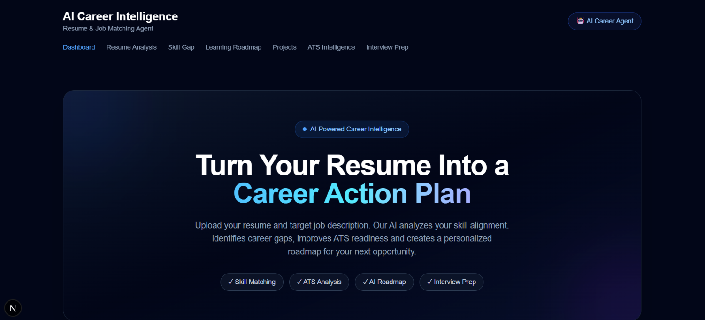

### 2. Resume & Job Description Upload
Upload the resume and target job description as PDF files.

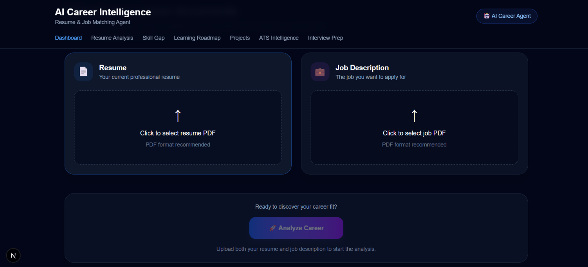

### 3. Resume Upload Success
Confirmation after successfully uploading and extracting the resume.

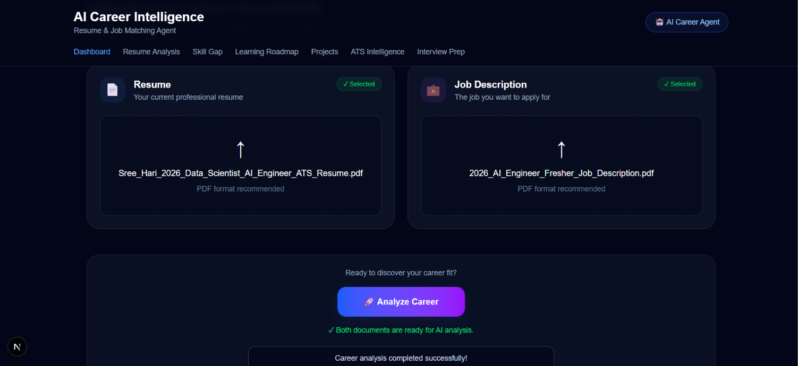

### 4. Career Analysis
Overall career compatibility analysis between the resume and target job.

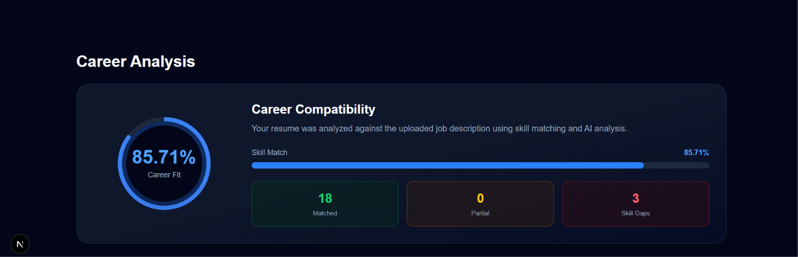

### 5. Skill Gap Analysis
Identifies matched, partial, and missing skills based on the target job.

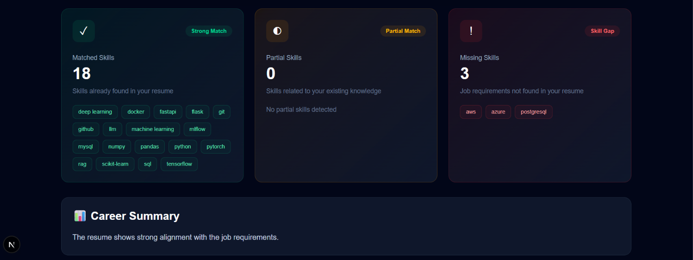

### 6. Personalized Learning Roadmap
Provides a structured 30-day, 60-day, and 90-day learning roadmap.

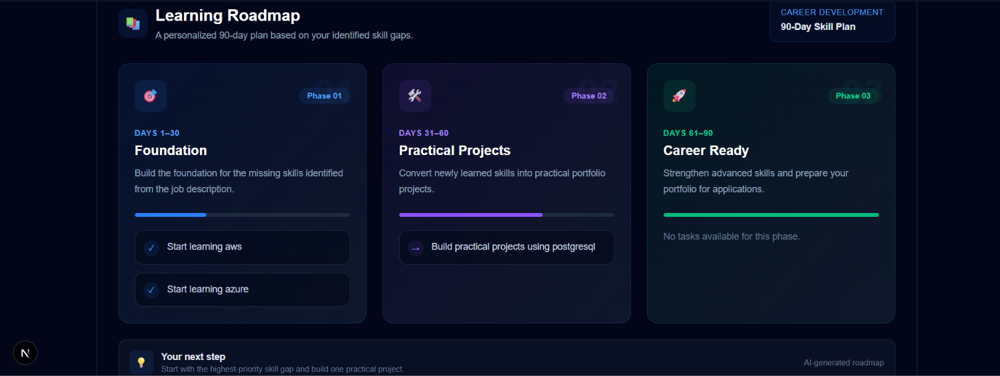

### 7. Recommended Portfolio Projects
Recommends practical projects based on identified skill gaps.

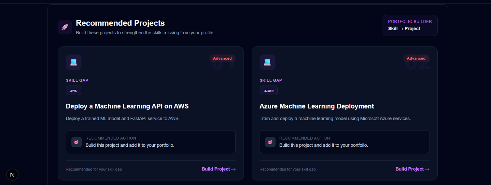

### 8. ATS Resume Analysis
Evaluates ATS keyword matching and resume structure.

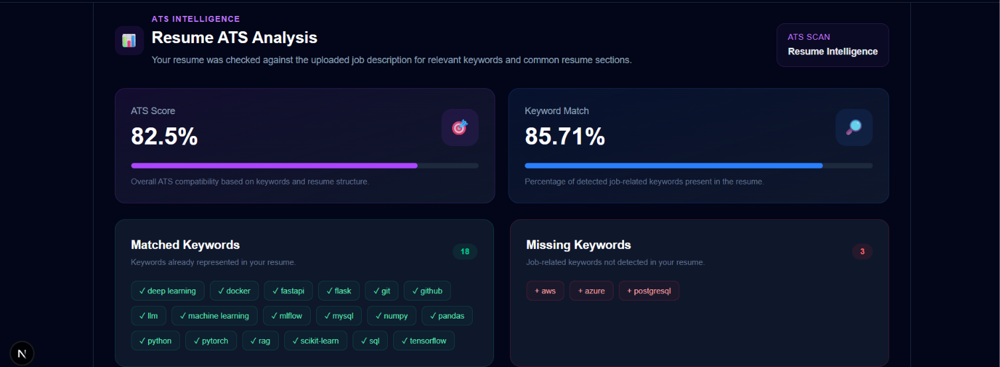

### 9. ATS Analysis Details
Detailed ATS keywords, sections, and improvement suggestions.

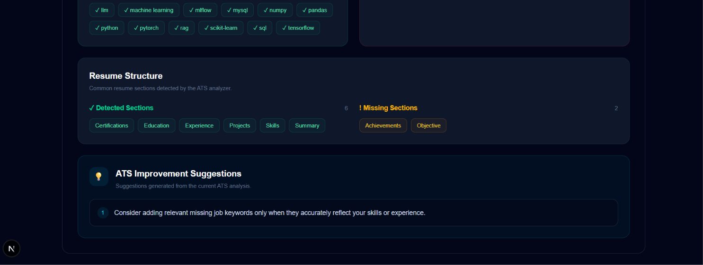

### 10. Interview Preparation
Generates technical interview questions based on job requirements.

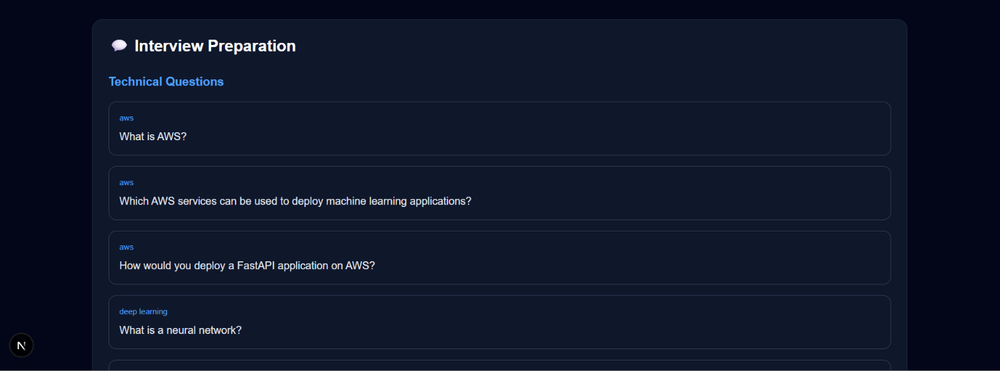

### 11. Skill Gap Interview Questions
Generates questions focused specifically on missing skills.

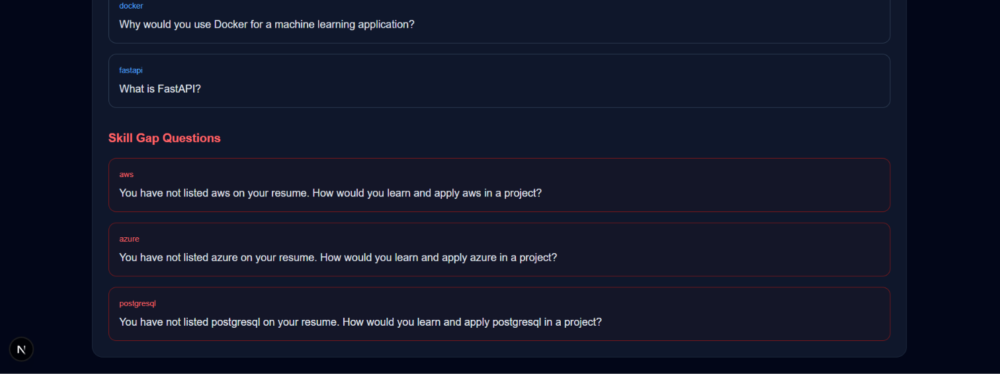
